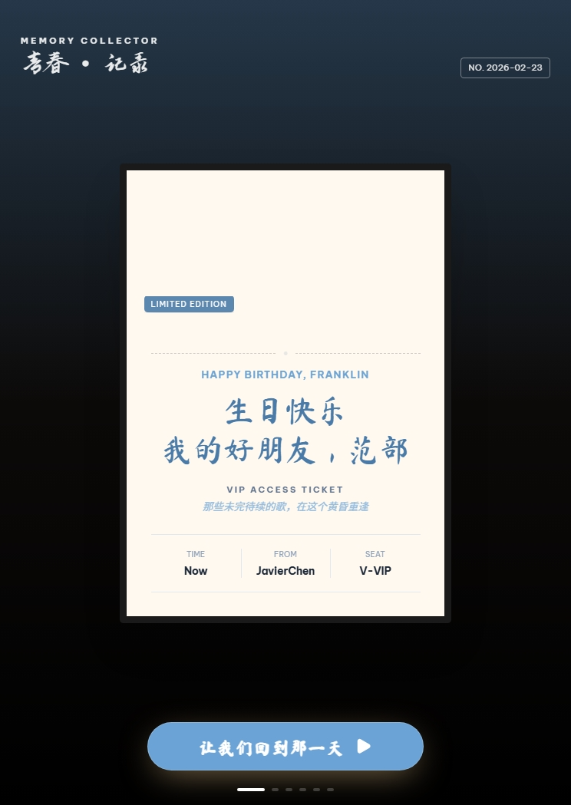
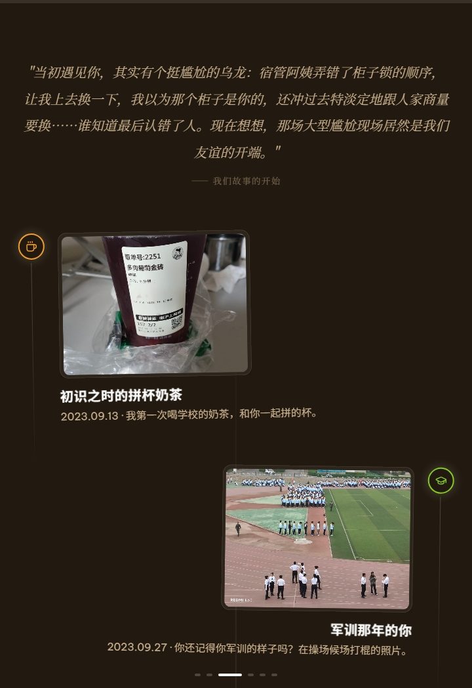
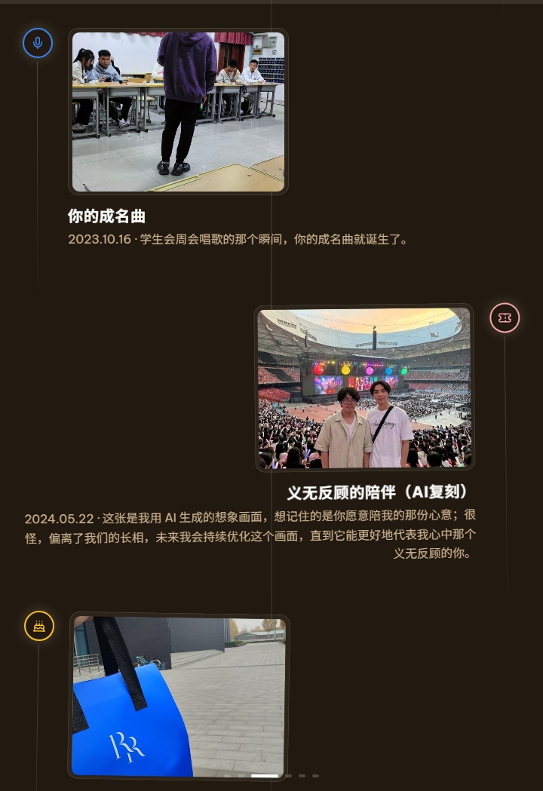
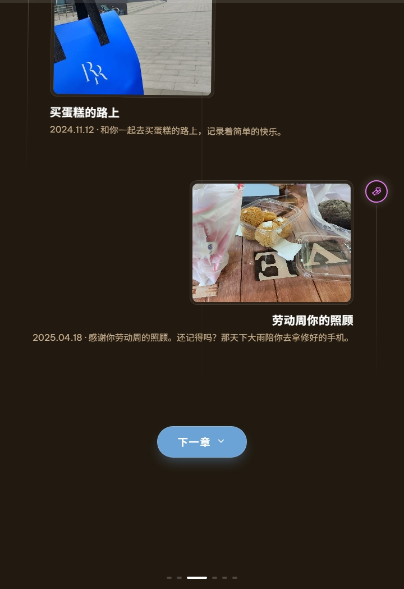
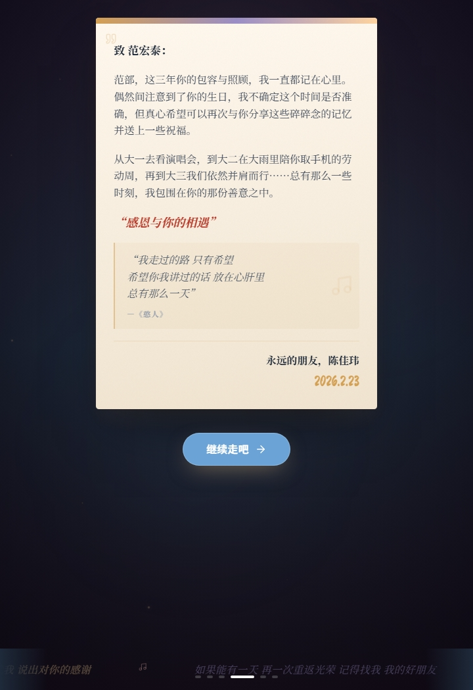
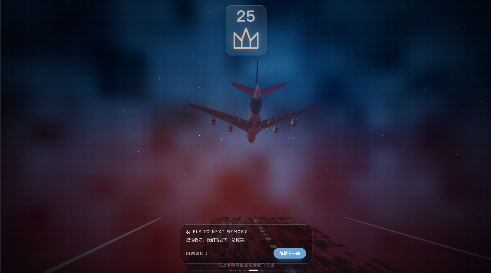
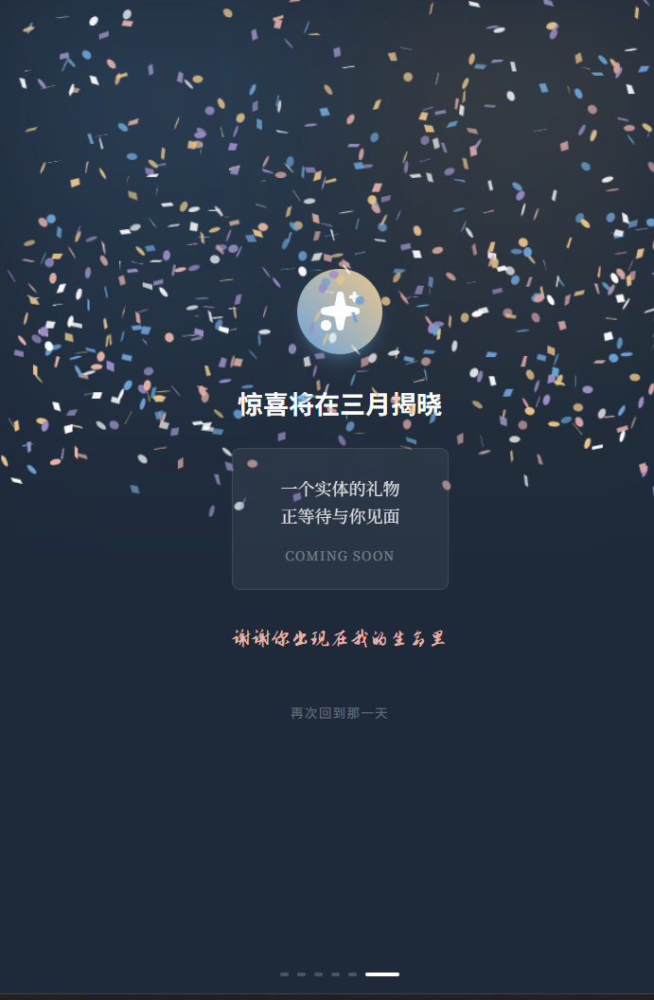

# web-for-fan-hong-tai

写给朋友的一份线上生日礼物。  
它不是一个“功能型网站”，更像一封会动的信、一次被保存下来的回忆。

## 初衷

这个项目最开始只是一个很简单的念头：

- 想把“谢谢你出现在我的生命里”说得更认真一点
- 想把几段一起走过的日子，做成可以慢慢翻阅的页面
- 想让生日祝福不只停在一句话，而是一段有温度的体验

如果你刚好点开这里，希望你也能感受到那份笨拙但真诚的心意。

## 小小导览

- 六段式互动场景：`Intro -> Candle -> Timeline -> Letter -> Airplane -> Gift`
- 过场与交互动画：基于 GSAP
- 加载页、进度指示、礼物彩蛋与庆祝动效
- 支持测试模式：URL `?test=true` 或环境变量 `VITE_APP_MODE=test`

## 回忆放在哪里

- 信件页文案：`content/letterContent.ts`
- 场景流程与切换：`App.tsx`
- 主要场景组件：`components/Scene*.tsx`

## 本地查看

前置要求：

- Node.js 18+（建议 Node.js 20 LTS）
- npm 9+

运行：

```bash
npm install
npm run dev
```

默认开发地址（见 `vite.config.ts`）：`http://localhost:3000`

常用命令：

```bash
npm run dev       # 本地开发
npm run build     # 生产构建（输出到 dist/）
npm run preview   # 预览构建产物
```

## 页面截图（按顺序）

> 来源目录：`page-screenshots/`  
> 排序规则：按文件名升序（`1.png` -> `7.png`）

### 1. `1.png`（744 x 1049）


### 2. `2.png`（720 x 1049）


### 3. `3.png`（720 x 1049）


### 4. `4.png`（720 x 1049）


### 5. `5.png`（720 x 1049）


### 6. `6.png`（1867 x 1039）


### 7. `7.png`（691 x 1056）


## 留个小尾巴

也许未来很久以后再回来看，它依然会提醒我们：  
有些真诚的瞬间，值得被好好保存。
